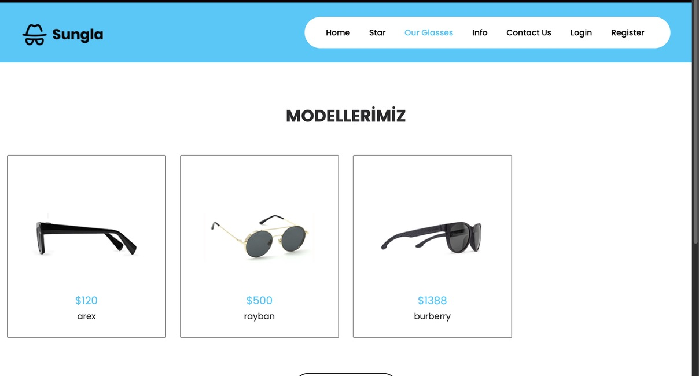
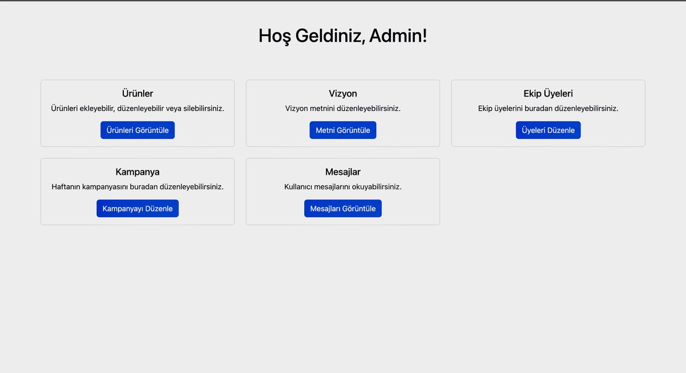
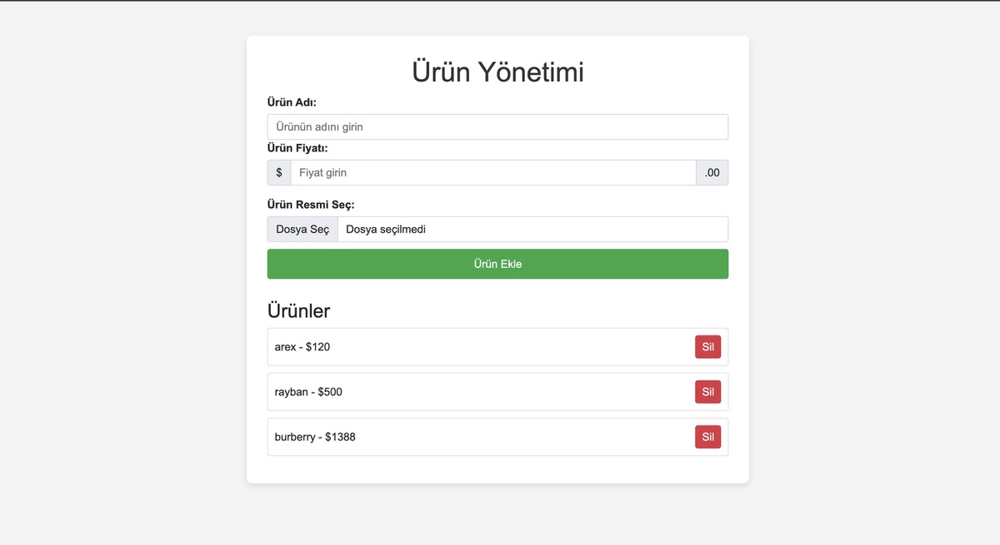

# Sungla Web Sitesi

**Sungla**, güneş gözlüğü mağazası için tasarlanmış modern ve duyarlı bir web sitesi şablonudur. HTML5, CSS3, ve Bootstrap 4 kullanılarak geliştirilmiş olan bu şablon, kullanıcı dostu bir arayüz ve temel işlevsellik sunmaktadır. Sungla, her tür cihazda mükemmel uyum sağlayacak şekilde tasarlanmıştır.



## Özellikler
- **Duyarlı Tasarım**: Masaüstü, tablet ve mobil cihazlarla tam uyumlu, kullanıcı dostu tasarım.
- **Ana Sayfa Carousel**: Ana sayfada kayan görsellerle şık bir görsel deneyimi.
- **Hakkımızda Sayfası**: Mağaza bilgileri, sunduğunuz fırsatlar ve vizyonunuz.
- **Ürün Listesi**: En popüler gözlük modellerinizi sergileyen görseller ve detaylar.
- **İletişim Formu**: Kullanıcı geri bildirimlerini toplar ve müşteri desteği sağlar.

## Kullanılan Teknolojiler
- **HTML5** ve **CSS3**: Web sayfası yapısının temelini oluşturur.
- **Bootstrap 4**: Hızlı ve duyarlı tasarımlar için kullanılan popüler CSS framework'ü.
- **JavaScript** ve **jQuery**: Etkileşimli öğeler ve animasyonlar için dinamik işlevler sağlar.
- **Font Awesome**: Web sitesi ikonları için kullanılan popüler ikon seti.

## Özellikler ve Sayfalar
### 1. Ana Sayfa
Ana sayfa, kullanıcıları karşılayan şık bir **carousel** (kaydırıcı) içerir. Göz alıcı görseller ve tanıtım yazılarıyla zenginleştirilmiştir.

### 2. Hakkımızda Sayfası
Mağaza bilgileri, vizyonunuz ve sunduğunuz fırsatlar hakkında bilgi veren bir bölümdür. Potansiyel müşterilere markanız hakkında net bir bakış açısı sağlar.

### 3. Ürünler
Çeşitli gözlük modellerinin yer aldığı bir liste. Her ürün için detaylı açıklamalar ve görseller bulunur. Kullanıcılar, ürünleri kolayca inceleyebilir ve satın alma işlemlerine yönlendirilebilir.

### 4. İletişim
Ziyaretçilerin sizinle kolayca iletişim kurabilmesi için bir form. Geri bildirim ve soru iletilerini alır.

## Admin Paneli
Sungla web sitesi, yöneticilerin ürün ekleyip düzenleyebileceği bir admin paneline sahiptir. Bu panelde ürünlerinizi yönetebilir, görselleri değiştirebilir ve mağazanızın içeriklerini güncelleyebilirsiniz.




## Kurulum Talimatları
1. **Depoyu Klonlayın**: Projeyi bilgisayarınıza klonlayarak başlayın:
   ```bash
   git clone https://github.com/zeynepayar/sungla.git
